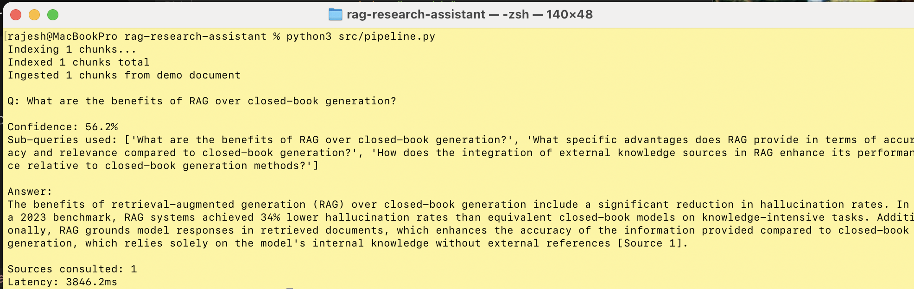

# rag-research-assistant
Basic RAG gives you an answer but no way to know how confident to be in it or which sources actually supported the claim. I built this for research use cases where you need citations, a confidence score, and a warning when your sources are contradicting each other. The multi-query expansion also helps a lot with recall on complex questions that a single embedding does not capture well.





I was working on a research project that required answering complex questions across dozens of papers, and basic semantic search kept returning irrelevant or contradicting sources. I wanted something that would show me exactly which documents it was using, flag contradictions, and give me a confidence score I could actually trust.


> Multi-document research Q&A with citations, confidence scores, and contradiction detection. Goes beyond basic RAG — expands queries, deduplicates chunks, and tells you when sources disagree.


---

## What makes this different from basic RAG

| Feature | Basic RAG | This project |
|---------|-----------|--------------|
| Query | 1 query | 3 queries (expansion) |
| Deduplication | ❌ | ✅ removes near-duplicate chunks |
| Confidence score | ❌ | ✅ per-answer confidence |
| Citations | Text only | ✅ structured with scores |
| Contradiction detection | ❌ | ✅ flags disagreeing sources |
| Source attribution | Filename | ✅ title + excerpt + relevance score |

---


## Architecture

```
Research Question
      │
      ▼
Query Expansion (GPT-4o-mini)
"RAG benefits?" → ["RAG benefits?", "RAG vs closed-book?", "RAG hallucination reduction?"]
      │
      ▼ (for each sub-query)
Dense Retrieval (text-embedding-3-small)
      │
      ▼
Merge + Deduplicate chunks
      │
      ├──► Contradiction Detection
      │
      ▼
GPT-4o-mini with [Source N] citation instructions
      │
      ▼
ResearchAnswer(answer, citations, confidence, contradictions)
```

---

## Quickstart

```bash
git clone https://github.com/racharajeshAI/rag-research-assistant
cd rag-research-assistant
pip install -r requirements.txt

export OPENAI_API_KEY=your_key

# CLI mode (loads 4 built-in research paper summaries)
python src/pipeline.py "What are the benefits of RAG over fine-tuning?"

# Gradio UI
python src/app.py
# Open http://localhost:7861
```

---

## Ingest your own documents

```python
from src.pipeline import ResearchRAG

rag = ResearchRAG(top_k=6)

# From raw text
rag.ingest_text(text, source="myfile.pdf", title="My Paper Title")

# From pre-chunked documents
from src.pipeline import Document
docs = [Document(text=chunk, source="paper.pdf", title="Paper Title", page=1)]
rag.ingest(docs)

result = rag.answer("Your research question here")
print(result.answer)
print(f"Confidence: {result.confidence:.1%}")
for cit in result.citations:
    print(f"[{cit['source_num']}] {cit['title']} — score {cit['score']:.3f}")
```

---

## Confidence scoring

Confidence is computed from three factors:
- **Retrieval score** (60%) — how similar are the top chunks to the question?
- **Source diversity** (24%) — more unique sources = higher confidence
- **Answer length** (16%) — very short answers may indicate uncertainty

A confidence below 0.5 means the knowledge base probably doesn't have great coverage for this question.

---

## Limitations

- Embeddings are in-memory — not persistent across restarts (add ChromaDB/FAISS for production)
- Contradiction detection is keyword-based — not a real NLI model
- No streaming response yet

---

## Roadmap

- [ ] ChromaDB persistent index
- [ ] PDF ingestion with PyMuPDF
- [ ] NLI-based contradiction detection (deberta-v3-large)
- [ ] Streaming answer generation
- [ ] Export citations as BibTeX
